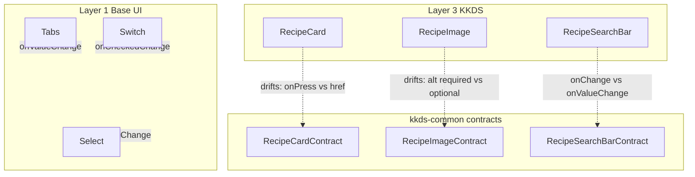
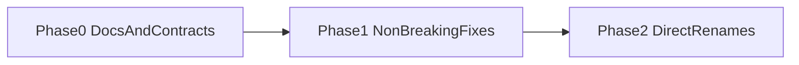

# KKDS Public Component API Consistency Audit

Historical audit of every public component exported from `@sverg84/kkds-react`.

**How to read this document**

| Layer | Meaning |
|---|---|
| Findings / per-component tables | State **at audit time** (Phase 0), before cleanup |
| Suggestions / migration plan | Recommendations from the audit |
| Status / **Done** markers / Phase completion notes | What has been **resolved since** the audit |

**Resolution summary (post-audit):** Phase 1 (Combobox export + correctness +
contract sync + Spinner `size`/`label`) and Phase 2 (direct renames:
`RecipeAuthor` `sm`, `RecipeSearchBar` `onValueChange`, `formatTagLabel`,
required `RecipeImage` `alt`) are complete. Deferred items remain under
Phase 3. See [Breaking changes register](#breaking-changes-register) and
[Migration plan](#migration-plan).

## Scope and method

Audited every export from `artifacts/kitchenkin-ds/src/index.ts`:

- Layer 3 — KitchenKin semantic components (8)
- Layer 2 — KKDS custom primitives (`Empty`, `Field`, `InputGroup`, `Spinner`)
- Layer 1 — curated shadcn / Base UI primitives
- Platform-neutral contracts from `lib/kkds-common/src/types/components.ts`

Checked for each public root (and compound parts where relevant):

- Prop naming consistency
- `className` support
- Ref forwarding
- Render-prop / polymorphism conventions
- Controlled vs uncontrolled APIs
- Event naming
- Optional props that should be required
- Duplicate props / unnecessary abstraction
- Missing documentation

### Chosen conventions for recommendations

Aligned with package architecture (web-first, Base UI primitives, avoid
premature cross-platform abstraction):

| Concern | Convention |
|---|---|
| Size tokens | `"default" \| "sm" \| "lg" \| "icon"` on primitives; Layer 3 maps to `"default" \| "sm"` |
| Controlled values | `value` / `defaultValue` + `onValueChange` (Base UI) |
| Boolean controls | `checked`/`defaultChecked`/`onCheckedChange`; `pressed`/`defaultPressed`/`onPressedChange`; `open`/`defaultOpen`/`onOpenChange` |
| Slot override | Base UI `render` (not Radix `asChild`) |
| Domain overrides | Named `renderX` (e.g. `renderImage`, `renderLink`) |
| Styling escape hatch | Always accept `className` on public roots |
| Refs | React 19 `ref` as prop via DOM / `ComponentProps` / Base UI; Layer 3 optional unless composition requires it |
| Contracts | Update `kkds-common` contracts to match current web APIs; drop speculative mobile-only props until a second platform exists |

**Decision locked in:** `Combobox` **must** be a public Layer 1 export.

---

## Cross-cutting findings (audit-time)

Status notes in parentheses reflect post-audit resolution. Unmarked items were
intentionally deferred or remain soft guidance.

1. **Public surface docs were wrong.** `src/index.ts` listed `Toggle` under
   “Excluded” while exporting it. `Combobox` exists at
   `src/components/ui/combobox.tsx` with a full compound API but is **not**
   re-exported from the package barrel — a required public gap. `docs/AGENTS.md`
   previously described `./components/*` subpath exports that `package.json`
   does not expose. **(Resolved:** Toggle inventory fixed; Combobox exported +
   demo; AGENTS export map aligned with `package.json`.)
2. **Documentation quality split.** Layer 3 has rich JSDoc; Layer 1/2 have
   almost none (rely on demos in `kkds-site`). **(Partially resolved:** Combobox,
   Empty, Field, InputGroup, Spinner JSDoc/DocBlocks added in Phase 1; broad
   Layer 1 JSDoc still light.)
3. **Contract drift.** Several `*Contract` types disagree with web props
   (`RecipeAuthor` size, `RecipeImage.alt`, `RecipeCard.onPress`,
   `RecipeMetadata.servings`, `Empty` / `Spinner` shape). **(Resolved** for the
   listed contracts in Phase 1; RecipeCard still does not pass `servings` —
   deferred.)
4. **Event naming split.** Base UI uses `onValueChange` / `onCheckedChange` /
   etc.; `RecipeSearchBar` uses `onChange: (value: string) => void`.
   **(Resolved:** renamed to `onValueChange`.)
5. **Size vocabulary split.** Primitives use `sm`; `RecipeAuthor` uses
   `compact`; contract uses `sm`. **(Resolved:** `size="sm"`.)
6. **No `forwardRef`.** Correct for React 19 + Base UI, but Layer 3 roots do
   not accept `ref` at all. **(Deferred** — Phase 3.)
7. **`className` nearly universal** except `RecipeCardSkeleton` ignores
   `className` when `count === 1`. **(Resolved.)**

---

## Layer 3 — per component

### RecipeCard — `src/components/kkds/recipe-card.tsx`

| Check | Status |
|---|---|
| Props | `title` required; `id?`, `description?`, `imageUrl?`, `tags?`, `prepTime?`, `cookTime?`, `href?`, `className?`, `action?`, `renderLink?`, `renderImage?` |
| className | Yes |
| ref | No |
| Render props | `renderLink`, `renderImage` |
| Controlled | N/A |
| Docs | Strong JSDoc |

**Suggestions**

| Suggestion | Breaking? | Confidence |
|---|---|---|
| Align contract: remove speculative `onPress`; document `href`/`renderLink` as web-only (or add optional web `onPress` later with mobile) | Contract-only (type consumers) | **High** |
| Pass `servings` through to `RecipeMetadata` for parity with detail surfaces | No (additive) | **Medium** |
| Document that `tags` are always rendered as `CategoryBadge` (allergens in tags lose visual distinction) | No | **High** |
| Accept and forward `ref` to root `Card` for measurement/focus | Possibly type-level | **Low** |
| Require `id` when `href` is set (stable `aria-labelledby`) | Yes | **Medium** |

---

### RecipeImage — `src/components/kkds/recipe-image.tsx`

| Check | Status |
|---|---|
| Props | `src?`, `alt?`, `aspectRatio?`, `priority?`, `className?`, `renderImage?` |
| Contract mismatch | Contract requires `alt: string`; impl allows `alt?: string \| null` |
| Render props | `renderImage` — good named convention |
| className | Yes |
| ref | No |
| Docs | Strong JSDoc |

**Suggestions**

| Suggestion | Breaking? | Confidence |
|---|---|---|
| Make `alt` required in props (match contract + a11y docs); allow empty string if needed | **Yes** | **High** |
| Keep `src` (image primitive) vs card’s `imageUrl` — document as intentional | No | **High** |
| Document that `priority` only affects default ``; `renderImage` consumers must honor it | No | **High** |

---

### RecipeMetadata — `src/components/kkds/recipe-metadata.tsx`

| Check | Status |
|---|---|
| Props | All optional (`prepTime`, `cookTime`, `servings`, `className`); returns `null` if all empty |
| Contract | Missing `servings` |
| className | Yes |
| ref | No |
| Docs | Strong JSDoc |

**Suggestions**

| Suggestion | Breaking? | Confidence |
|---|---|---|
| Add `servings` to `RecipeMetadataContract` | No | **High** |
| Keep all-optional + null render (valid empty composition) | — | **High** |
| Consider distinct icons for prep vs cook (both use `Clock`) — visual, not API | No | **Low** |

---

### RecipeAuthor — `src/components/kkds/recipe-author.tsx`

| Check | Status |
|---|---|
| Size | Impl: `'default' \| 'compact'`; Contract: `'default' \| 'sm'`; Avatar primitive: `'default' \| 'sm' \| 'lg'` |
| Props | `name` required; `avatarUrl?`, `subtitle?`, `size?`, `className?` |
| className | Yes |
| ref | No |
| Docs | Strong JSDoc |

**Suggestions**

| Suggestion | Breaking? | Confidence |
|---|---|---|
| Rename `compact` → `sm` to match Avatar/Button/Switch and contract | **Yes** | **High** |
| Ship one-release alias: accept both `compact` and `sm`, deprecate `compact` | Soft-break | **High** |
| Optional `href`/`renderLink` for author profile navigation (parity with card) | No (additive) | **Medium** |

---

### RecipeSearchBar — `src/components/kkds/recipe-search-bar.tsx`

| Check | Status |
|---|---|
| Controlled | Controlled-only: `value` + `onChange` required |
| Events | `onChange(value: string)` — not DOM `ChangeEvent`; differs from Base UI `onValueChange` |
| Uncontrolled | No `defaultValue` |
| className | Yes |
| ref | No |
| Docs | Strong; notes `"use client"` |

**Suggestions**

| Suggestion | Breaking? | Confidence |
|---|---|---|
| Rename `onChange` → `onValueChange` (align Tabs/Select/Base UI); dual-support then remove | **Yes** (after deprecation) | **High** |
| Add optional uncontrolled `defaultValue` only if product needs it — otherwise keep controlled-only and document | No if skipped | **Medium** |
| Expose `disabled`, `name`, `id`, `autoFocus` passthrough for forms | No | **Medium** |
| Allow overriding hardcoded `aria-label="Search recipes"` | No | **Medium** |

---

### CategoryBadge — `src/components/kkds/category-badge.tsx`

| Check | Status |
|---|---|
| Props | `label` required; `className?` |
| className | Yes |
| ref | No (does not forward Badge/`render`) |
| Docs | Strong JSDoc |
| Helper | Exports `formatTagLabel` |

**Suggestions** — see shared badge section below.

---

### AllergenBadge — `src/components/kkds/allergen-badge.tsx`

| Check | Status |
|---|---|
| Props | `label` required; `className?` |
| className | Yes |
| ref | No |
| Docs | Strong JSDoc |
| Composition | `Badge variant="outline"` + muted foreground; reuses `formatTagLabel` |

---

### CategoryBadge / AllergenBadge (shared)

Nearly identical wrappers around `Badge` (`secondary` vs `outline` + muted).
Share `formatTagLabel` from the category module (generalized tag humanizer).

**Suggestions**

| Suggestion | Breaking? | Confidence |
|---|---|---|
| Keep two components (semantic distinction is intentional per `audit-phase2.md`) | — | **High** |
| Rename shared helper to `formatTagLabel` (or move to `kkds-common` next to `categoryLabel`/`allergenLabel`) | Soft — **done as `formatTagLabel`** | **High** |
| Prefer typed `AllergenTag` / `RecipeCategory` props with `label: string` overload for freeform | Soft | **Medium** |
| Avoid merging into one `variant` prop — would erase domain API | — | **High** |

---

### RecipeCardSkeleton — `src/components/kkds/recipe-card-skeleton.tsx`

| Check | Status |
|---|---|
| Props | `count?` (default `1`), `className?` |
| className | **Bug:** applied only when `count > 1`; ignored for default `count={1}` |
| ref | No |
| Docs | Strong JSDoc |

**Suggestions**

| Suggestion | Breaking? | Confidence |
|---|---|---|
| Always apply `className` to the outermost element | No (fixes dead prop) | **High** |
| Split `RecipeCardSkeleton` (single) vs `RecipeCardSkeletonGrid` (count+grid) to remove layout abstraction in one API | Soft | **Medium** |

---

## Layer 2 — per family

### Empty — compound

Parts: `Empty`, `EmptyHeader`, `EmptyMedia`, `EmptyTitle`, `EmptyDescription`,
`EmptyContent`.

| Issue | Detail | Confidence |
|---|---|---|
| Contract mismatch | `EmptyContract` is flat (`title`, `icon`, `actionLabel`); impl is compound composition | **High** |
| Element/type mismatch | `EmptyDescription` types as `ComponentProps<"p">` but renders `
` | **High** |
| Slot naming | Component `EmptyMedia`, `data-slot="empty-icon"` | **Medium** |
| Docs | No JSDoc on components | **High** |
| className | Yes on all parts | **High** |

**Suggestions:** Update/remove misleading `EmptyContract`; fix description
element to `
` or widen types; rename slot to `empty-media`; add JSDoc +
DocBlock. Prefer keeping compound API (matches shadcn) over collapsing to flat
props.

---

### Field — compound

Parts: `Field`, `FieldSet`, `FieldGroup`, `FieldLegend`, `FieldLabel`,
`FieldTitle`, `FieldDescription`, `FieldSeparator`, `FieldContent`, `FieldError`.

| Issue | Detail | Confidence |
|---|---|---|
| Duplicate abstraction | `FieldLabel` and `FieldTitle` both use `data-slot="field-label"` | **High** |
| Docs | Missing | **High** |
| `FieldError` | Dual API: `children` or `errors[]` — useful but undocumented | **Medium** |
| className | Yes on all parts | **High** |

**Suggestions:** Document when to use Label vs Title; consider distinct slots;
add JSDoc. No merge/removal unless unused in demos.

---

### InputGroup — compound

Parts: `InputGroup`, `InputGroupAddon`, `InputGroupButton`, `InputGroupText`,
`InputGroupInput`, `InputGroupTextarea`.

Solid composition for `RecipeSearchBar`. `InputGroupButton` redefines `size`
(`xs`, `icon-xs`, …) separately from `Button` — intentional but undocumented.

| Suggestion | Breaking? | Confidence |
|---|---|---|
| Document size override table vs `Button` sizes | No | **High** |

---

### Spinner — `src/components/ui/spinner.tsx`

| Check | Status |
|---|---|
| Props | `React.ComponentProps<"svg">` |
| Contract mismatch | `SpinnerContract` has `size`/`label`; impl is fixed `size-4` and hardcoded `aria-label="Loading"` |
| className | Yes |
| Docs | None |

**Suggestions:** Add `size?: "sm" \| "default" \| "lg"` and `label?: string` to
match contract, or shrink contract to reality. Prefer implementing size/label
(additive). Confidence **High**.

---

## Layer 1 — family summary

Pattern: thin Base UI / DOM wrappers; almost all support `className`; refs via
Base UI / `ComponentProps` (React 19); controlled APIs inherited from Base UI;
little/no JSDoc.

| Family | Controlled API | Render override | Notable inconsistency |
|---|---|---|---|
| Button | N/A | Base UI props (no local `asChild`) | No JSDoc; variants via CVA |
| Badge | N/A | `render` via `useRender` | Explicit public `render` polymorphism |
| Input / Textarea / Label | native | — | Consistent |
| Switch | `checked` / `defaultChecked` / `onCheckedChange` | — | Size `sm\|default` OK |
| Toggle | `pressed` / `defaultPressed` / `onPressedChange` | — | Exported; inventory comment previously wrong |
| Tabs | `value` / `defaultValue` / `onValueChange` | — | Part names `TabsTrigger`/`TabsContent` vs Base UI `Tab`/`Panel` — shadcn naming, keep |
| Select | Base UI value/open | internal `render` for icons | Size on trigger only |
| Dialog / AlertDialog / Popover | `open` / `defaultOpen` / `onOpenChange` | internal `render` | Consistent |
| DropdownMenu | open/change via Base UI | — | Consistent compound |
| Avatar | — | — | Size `default\|sm\|lg` — RecipeAuthor should align |
| Card | — | — | `size` on root; titles are `div` not headings (callers supply semantics — RecipeCard uses `h3`) |
| AspectRatio | — | — | `ratio` **required** (good) |
| Skeleton / Separator / ScrollArea | — | — | Fine |
| Combobox | Base UI value/open (compound) | internal `render` + InputGroup composition | **Must be public** — source complete, barrel export missing; no kkds-site demo/registry yet |

---

### Combobox — required public export — `src/components/ui/combobox.tsx`

Already implemented compound parts: `Combobox`, `ComboboxInput`,
`ComboboxContent`, `ComboboxList`, `ComboboxItem`, `ComboboxGroup`,
`ComboboxLabel`, `ComboboxCollection`, `ComboboxEmpty`, `ComboboxSeparator`,
`ComboboxChips`, `ComboboxChip`, `ComboboxChipsInput`, `ComboboxTrigger`,
`ComboboxValue`, `useComboboxAnchor`.

| Check | Status |
|---|---|
| className | Yes on styled parts |
| ref | Via Base UI / `useComboboxAnchor` |
| Controlled | Inherited Base UI (`value` / `defaultValue` / `onValueChange`, open state) |
| Render | Base UI `render` (aligned with Badge/Select) |
| Docs | None; no preview demo |
| Public barrel | **Missing** (required gap) |

**Suggestions**

| Suggestion | Breaking? | Confidence |
|---|---|---|
| Re-export all Combobox parts from `src/index.ts` Layer 1 section | No (additive) | **High** |
| List Combobox in the index inventory comment (Included) | Docs | **High** |
| Add kkds-site Combobox demo + registry covering single-select, chips, empty, and clear | No | **High** |
| Document relationship to Select (closed list) vs Combobox (filterable/searchable) and vs RecipeSearchBar (free-text recipe filter, not option picking) | No | **High** |

**Layer 1 suggestions (mostly non-breaking)**

| Suggestion | Breaking? | Confidence |
|---|---|---|
| Fix `index.ts` inventory: Toggle included; **Combobox must be exported** | Additive export | **High** |
| Add brief JSDoc or link each family demo as canonical docs | No | **High** |
| Document Base UI `render` as the polymorphism convention (not `asChild`) | No | **High** |
| Do not rename Tabs/Dialog part names — match shadcn ecosystem | — | **High** |

---

## Suggested API improvements (priority)

**P0 — correctness / honesty (low risk)**

1. Fix public export comments and AGENTS export map.
2. **Export Combobox** from the package barrel; add demo + registry entry.
3. Apply `className` on `RecipeCardSkeleton` for `count === 1`.
4. Fix `EmptyDescription` element/type mismatch.
5. Sync contracts: `servings`, `alt`, RecipeAuthor size, Empty/Spinner,
   drop/adjust `onPress`.

**P1 — naming consistency (direct pre-adoption renames; no aliases) — done**

6. `RecipeAuthor` `compact` → `sm`.
7. `RecipeSearchBar` `onChange` → `onValueChange`.
8. `formatCategoryLabel` → `formatTagLabel`.
9. `RecipeImage` `alt: string` required.

**P2 — API completeness (additive)**

10. Spinner `size` + `label` — done in Phase 1.
11. RecipeSearchBar a11y/form passthroughs — deferred.
12. RecipeCard optional `servings` — deferred.
13. Layer 1/2 JSDoc + DocBlocks (including Combobox) — done in Phase 1.

**P3 — structural (optional; deferred)**

14. Split skeleton single vs grid.
15. Layer 3 `ref` policy — defer until consumer need.

---

## Breaking changes register

| Change | Status |
|---|---|
| `RecipeAuthor size="compact"` → `"sm"` | **Done** (direct; no alias) |
| `RecipeSearchBar onChange` → `onValueChange` | **Done** (direct; no alias) |
| `formatCategoryLabel` → `formatTagLabel` | **Done** (direct; no alias) |
| `RecipeImage alt` required | **Done** (`alt=""` allowed for decorative) |
| Contract field removals/renames (`onPress`, Empty content model) | **Done** in Phase 1 |
| Combobox newly exported | **Done** in Phase 1 |

Package is `0.1.0` with zero external consumers — breaking renames applied directly.

---

## Migration plan

### Phase 0 — Audit artifact + surface honesty (this document)

- Write `docs/api-consistency-audit.md` (this file). **Done.**
- Correct `index.ts` / AGENTS export claims. **Done.**
- Document Combobox as a **required** missing public export. **Done** (Phase 0);
  Phase 1 exported it.

### Phase 1 — Non-breaking fixes + required Combobox export — **completed**

- Re-export Combobox compound API from `src/index.ts`. **Done.**
- Add kkds-site Combobox demo + registry. **Done.**
- Skeleton `className` for `count === 1`. **Done.**
- EmptyDescription element/type fix. **Done.**
- Contract sync; Spinner size/label. **Done.**
- Docs for Field/InputGroup/Empty; JSDoc pass on Layer 1 roots including Combobox. **Done.**

### Phase 2 — Direct renames (pre-adoption; no aliases) — **completed**

- `RecipeAuthor` `compact` → `sm` (no alias).
- `RecipeSearchBar` `onChange` → `onValueChange` (no alias).
- `formatCategoryLabel` → `formatTagLabel` (no alias).
- `RecipeImage` `alt: string` required (`alt=""` for decorative).
- All in-repo callers, contracts, and living docs updated.

### Phase 3 — Deferred / out of scope

- Optional skeleton split / RecipeCard `servings` / broad Layer 3 refs —
  not implemented (no current product demand).

Each phase: typecheck `@sverg84/kkds-react` + `@workspace/kkds-site`; update
demos/registry in the same PR; no visual/behavior changes except intentional
prop renames.

---

## Source inventory (public at audit time)

| Layer | Public components |
|---|---|
| 3 | `AllergenBadge`, `CategoryBadge`, `RecipeAuthor`, `RecipeCard`, `RecipeCardSkeleton`, `RecipeImage`, `RecipeMetadata`, `RecipeSearchBar` |
| 2 | `Empty` (+ parts), `Field` (+ parts), `InputGroup` (+ parts), `Spinner` |
| 1 | `AlertDialog`, `AspectRatio`, `Avatar`, `Badge`, `Button`, `Card`, `Combobox`, `Dialog`, `DropdownMenu`, `Input`, `Label`, `Popover`, `ScrollArea`, `Select`, `Separator`, `Skeleton`, `Switch`, `Tabs`, `Textarea`, `Toggle` |
